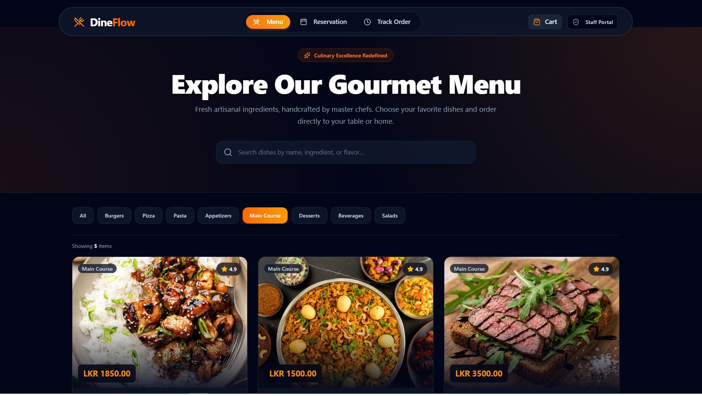

# 🍽️ DineFlow

DineFlow is a full-stack restaurant ordering and management system that allows customers to browse menus, place orders, and reserve tables, while administrators can manage menu items, orders, and reservations.

The project uses a microservices architecture with separate services for authentication, menu management, and order management.

<p align="center">
  
</p>

---

# 🚀 How to Run

## Prerequisites

Make sure the following are installed:

* Java 21
* Node.js 18+
* npm
* PostgreSQL
* Git

Check the installations:

```bash
java -version
node -v
npm -v
psql --version
```

---

# 1. Clone the Repository

```bash
git clone https://github.com/Sithija-R/DineFlow---Restaurant-ordering-and-management-system.git
cd DineFlow
```

# 2. Configure PostgreSQL

Make sure PostgreSQL is installed and running.

Default PostgreSQL configuration:

```text
Host: localhost
Port: 5432
Username: postgres
```

Create the required databases:

```sql
CREATE DATABASE dineflow;
CREATE DATABASE dineflow_menu;
CREATE DATABASE dineflow_order;
```

---

# 3. Configure the `.env` File

The project uses a root `.env` file for database, JWT, backend port, and frontend API configuration.

Create the file here:

```text
DineFlow/
│
├── .env          ← Create/configure this file
├── auth_service/
├── menu_service/
├── order_service/
├── frontend/
└── start-all.bat
```

Add:

```env
AUTH_DB_NAME=dineflow
MENU_DB_NAME=dineflow_menu
ORDER_DB_NAME=dineflow_order

DB_USERNAME=postgres
DB_PASSWORD=YOUR_POSTGRES_PASSWORD
DB_HOST=localhost
DB_PORT=5432

JWT_SECRET=YOUR_JWT_SECRET

AUTH_SERVICE_PORT=8080
MENU_SERVICE_PORT=8081
ORDER_SERVICE_PORT=8082

VITE_AUTH_API_URL=http://localhost:8080
VITE_MENU_API_URL=http://localhost:8081
VITE_ORDER_API_URL=http://localhost:8082
```


> **Do not change the service ports or API URLs unless you have also changed the corresponding application ports.**

---

# 4. Install Frontend Dependencies

Before running the application for the first time:

```bash
cd frontend
npm install
```

After installation, return to the project root:

```bash
cd ..
```

You only need to run `npm install` again if the frontend dependencies change or the `node_modules` directory is removed.

---

# 5. Run the Complete Project

## Windows

DineFlow includes a script that automatically starts all services:

```text
start-all.bat
```

From the project root run on`cmd`:

```cmd
start-all.bat
```

Or simply double-click:

```text
start-all.bat
```

The script automatically starts:

```text
PostgreSQL
    │
    ├── Auth Service   → 8080
    ├── Menu Service   → 8081
    ├── Order Service  → 8082
    └── Frontend       → 5173 / 5174
```

The script opens a separate terminal window for each application.

> **PostgreSQL must already be running before executing `start-all.bat`.**

# Run Individual Services

The project uses a root .env file for database credentials, JWT configuration, service ports, and frontend API URLs.

When running an individual service directly from PowerShell, load the root .env first for the backend services.

### 1. Auth Service
```bash
cd "D:\App dev\DineFlow"

Get-Content .env | ForEach-Object {
    if ($_ -match '^\s*([^#][^=]*)=(.*)$') {
        [System.Environment]::SetEnvironmentVariable(
            $matches[1].Trim(),
            $matches[2].Trim(),
            "Process"
        )
    }
}

cd auth_service
.\gradlew.bat bootRun
```
```Runs on http://localhost:8080.```

### 2. Menu Service
```bash
cd "D:\App dev\DineFlow"

Get-Content .env | ForEach-Object {
    if ($_ -match '^\s*([^#][^=]*)=(.*)$') {
        [System.Environment]::SetEnvironmentVariable(
            $matches[1].Trim(),
            $matches[2].Trim(),
            "Process"
        )
    }
}

cd menu_service
.\gradlew.bat bootRun
```
```Runs on http://localhost:8081.```

### 3. Order Service
```bash
cd "D:\App dev\DineFlow"

Get-Content .env | ForEach-Object {
    if ($_ -match '^\s*([^#][^=]*)=(.*)$') {
        [System.Environment]::SetEnvironmentVariable(
            $matches[1].Trim(),
            $matches[2].Trim(),
            "Process"
        )
    }
}

cd order_service
.\gradlew.bat bootRun
```
```Runs on http://localhost:8082.```

### 4. Frontend

The frontend uses the VITE_* variables from the root .env file for the backend API URLs.

Load the root .env first:
```bash
cd "D:\App dev\DineFlow"

Get-Content .env | ForEach-Object {
    if ($_ -match '^\s*([^#][^=]*)=(.*)$') {
        [System.Environment]::SetEnvironmentVariable(
            $matches[1].Trim(),
            $matches[2].Trim(),
            "Process"
        )
    }
}
```
Install dependencies if this is the first run:
```bash
cd frontend
npm install
```
Start the frontend:
```bash
npm run dev
```
The frontend normally runs on:

```
http://localhost:5173
```
---

# 🏗️ Project Structure

```text
DineFlow/
│
├── auth_service/
│   ├── src/
│   ├── build.gradle
│   ├── gradlew
│   └── gradlew.bat
│
├── menu_service/
│   ├── src/
│   ├── build.gradle
│   ├── gradlew
│   └── gradlew.bat
│
├── order_service/
│   ├── src/
│   ├── build.gradle
│   ├── gradlew
│   └── gradlew.bat
│
├── frontend/
│   ├── src/
│   ├── public/
│   ├── package.json
│   └── vite.config.ts
│
├── .env
├── .gitignore
├── start-all.bat
└── README.md
```

---

# 🏗️ Architecture

```text
                         ┌─────────────────────┐
                         │      Frontend       │
                         │  React + TypeScript │
                         │   Vite + Tailwind   │
                         └──────────┬──────────┘
                                    │
                  ┌─────────────────┼─────────────────┐
                  │                 │                 │
                  ▼                 ▼                 ▼
          ┌──────────────┐  ┌──────────────┐  ┌──────────────┐
          │ Auth Service │  │ Menu Service │  │ Order Service│
          │    :8080     │  │    :8081     │  │    :8082     │
          └──────┬───────┘  └──────┬───────┘  └──────┬───────┘
                 │                 │                 │
                 └─────────────────┼─────────────────┘
                                   ▼
                           ┌───────────────┐
                           │  PostgreSQL   │
                           │     :5432     │
                           └───────────────┘
```

---

# 🛠️ Technology Stack

## Frontend

* React
* TypeScript
* Vite
* Tailwind CSS
* shadcn/ui
* Lucide React
* React Router
* Zustand
* Axios

## Backend

* Java 21
* Spring Boot
* Spring Web
* Spring Data JPA
* Spring Security
* JWT
* Bean Validation
* Gradle
* Lombok
* SpringDoc OpenAPI

## Database

* PostgreSQL
* Hibernate
* JPA

---

# 👤 Customer Features

* User registration and login
* JWT authentication
* Browse food categories
* Browse menu items
* Add items to cart
* Place orders
* Dine-in orders
* Takeaway orders
* Track order status
* Search orders by reference
* Make restaurant reservations
* Check reservation status
* View available restaurant tables

---

# 👨‍💼 Admin Features

* Admin authentication
* Manage food categories
* Create menu items
* Update menu items
* Delete menu items
* Manage menu item availability
* View customer orders
* Manage order status
* Kitchen order Kanban board
* Manage restaurant reservations
* View reservation information

---

# 📌 Service Summary

| Service         | Technology   |            Port | Purpose                    |
| --------------- | ------------ | --------------: | -------------------------- |
| `auth_service`  | Spring Boot  |          `8080` | Authentication & JWT       |
| `menu_service`  | Spring Boot  |          `8081` | Menu & category management |
| `order_service` | Spring Boot  |          `8082` | Orders & reservations      |
| `frontend`      | React + Vite | `5173` / `5174` | Customer & Admin UI        |
| PostgreSQL      | PostgreSQL   |          `5432` | Database                   |

---

# 🔐 Authentication

DineFlow uses JWT-based authentication.

```text
Customer / Admin
       │
       ▼
   Frontend
       │
       │ Login
       ▼
 Auth Service
    :8080
       │
       │ JWT
       ▼
   Frontend
       │
       │ Authenticated API Requests
       ▼
 ┌──────────────┐
 │ Menu Service │
 │ Order Service│
 └──────────────┘
```

---

# 📡 API Overview

## Auth Service

```text
http://localhost:8080
```

Responsible for:

* Registration
* Login
* JWT generation
* Authentication
* Role-based authorization

---

## Menu Service

```text
http://localhost:8081
```

Main functionality:

```http
GET    /api/categories
GET    /api/categories/{id}

GET    /api/menu-items
GET    /api/menu-items/{id}

POST   /api/categories
PUT    /api/categories/{id}
DELETE /api/categories/{id}

POST   /api/menu-items
PUT    /api/menu-items/{id}
DELETE /api/menu-items/{id}
```

---

## Order Service

```text
http://localhost:8082
```

Main functionality:

```http
POST   /api/orders
GET    /api/orders
GET    /api/orders/{reference}

GET    /api/tables
GET    /api/tables/{id}

POST   /api/reservations
GET    /api/reservations
GET    /api/reservations/{id}

GET    /api/reservations/reference/{reference}

PATCH  /api/reservations/{id}/status
```

---

# 🧪 API Testing

The backend APIs can be tested using:

* Postman
* Frontend application

Example:

```http
GET http://localhost:8081/api/categories
```

```http
GET http://localhost:8081/api/menu-items
```

```http
GET http://localhost:8082/api/orders
```

```http
GET http://localhost:8082/api/reservations
```

---

